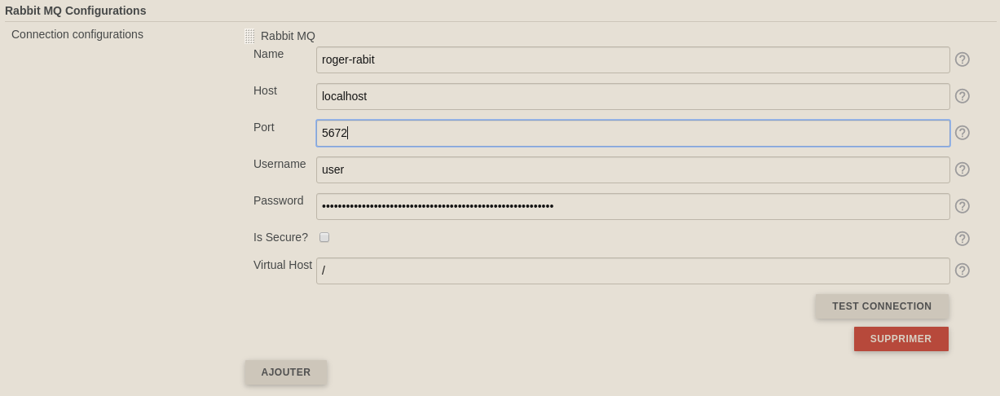

# Rabbit-MQ Publisher Plugin

Plugin for Jenkins, allowing to publish message on a Rabbit MQ.

Older versions of this plugin may not be safe to use. Please review the
following warnings before using an older version:

-   [Credentials stored in plain
    text](https://jenkins.io/security/advisory/2019-03-06/#SECURITY-848)
-   [Server-side request
    forgery](https://jenkins.io/security/advisory/2019-03-06/#SECURITY-970)

## Description

This plugin allows to create a build step which can publish a message to Rabbit MQ

2 parts:

-   Configuration of the Rabbit Host
-   Configuration of the step

The message can be a raw json, or a simple string,  or a list a
key/value which can be converted to a json string.

## Usage

### System configuration

Add your connection configurations with the parameters:

-   name: label to select the desired configuration on the build step
-   host: the default host to use for connections
-   port: the default port to use for connections
-   username: the AMQP user name to use when connecting to the broker
-   password: the password to use when connecting to the broker

Example: 

### Job configuration

1.  Select the *Publish to Rabbit-MQ* step:  

    
    
2.  Add your configuration to publish your message   

     
      
    You can use build parameters (eg: `${FOO}` or `$FOO`) which will be
    resolved before sending the message. You can also use
    `${BUILD\_USER\_ID}` and `${BUILD\_USER\_NAME}` to retrieve the
    informations from the user who launches the job.